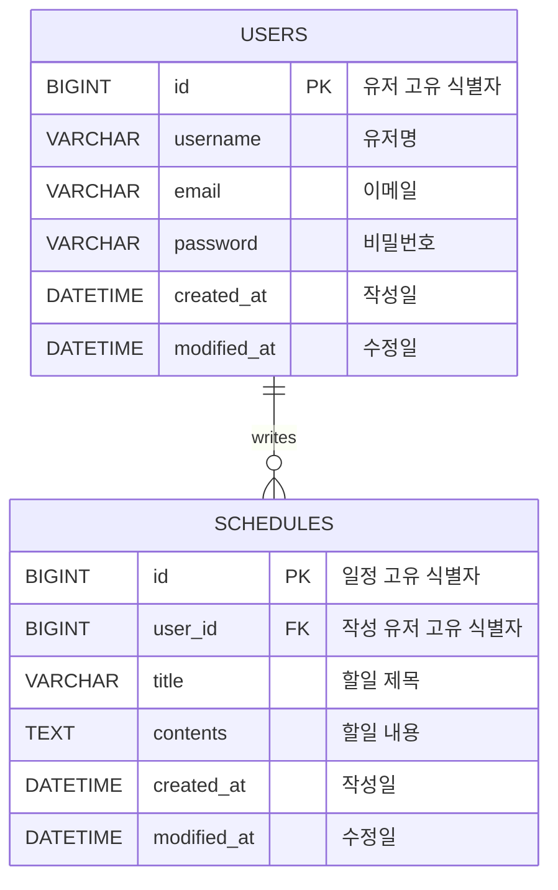

## develop-schedule

Spring Boot와 JPA를 활용한 일정 관리 API 프로젝트입니다.

### 프로젝트 목표

- JPA를 활용한 일정 CRUD 구현
- 유저 CRUD 구현
- 일정과 유저의 단방향 연관관계 구현
- Cookie/Session 기반 로그인/로그아웃 구현
- API 명세서 및 ERD 작성

### 기술 스택

- Java 17
- Spring Boot
- Spring Web
- Spring Data JPA
- My SQL
- Lombok
- Validation

### API 명세서

| 기능 | Method | URL |
|---|---|---|
| 일정 생성 | POST | /schedules |
| 일정 전체 조회 | GET | /schedules |
| 일정 단건 조회 | GET | /schedules/{id} |
| 일정 수정 | PATCH | /schedules/{id} |
| 일정 삭제 | DELETE | /schedules/{id} |
| 회원가입 | POST | /users/signup |
| 유저 전체 조회 | GET | /users |
| 유저 단건 조회 | GET | /users/{id} |
| 유저 수정 | PATCH | /users/{id} |
| 유저 삭제 | DELETE | /users/{id} |
| 로그인 | POST | /login |
| 로그아웃 | POST | /logout |

---

## 일정 API

### 일정 생성 `POST /schedules`

Request
```json
{
  "title": "할일 제목",
  "contents": "할일 내용"
}
```

Response
```json
{
  "id": 1,
  "username": "jeongyun",
  "title": "할일 제목",
  "contents": "할일 내용",
  "createdAt": "2026-07-07T10:00:00",
  "modifiedAt": "2026-07-07T10:00:00"
}
```

### 일정 전체 조회 `GET /schedules`

Response
```json
[
  {
    "id": 1,
    "username": "jeongyun",
    "title": "할일 제목",
    "contents": "할일 내용",
    "createdAt": "2026-07-07T10:00:00",
    "modifiedAt": "2026-07-07T10:00:00"
  }
]
```

### 일정 단건 조회 `GET /schedules/{id}`

Response
```json
{
  "id": 1,
  "username": "jeongyun",
  "title": "할일 제목",
  "contents": "할일 내용",
  "createdAt": "2026-07-07T10:00:00",
  "modifiedAt": "2026-07-07T10:00:00"
}
```

### 일정 수정 `PATCH /schedules/{id}`

Request
```json
{
  "title": "수정된 제목",
  "contents": "수정된 내용"
}
```

Response
```json
{
  "id": 1,
  "username": "jeongyun",
  "title": "수정된 제목",
  "contents": "수정된 내용",
  "createdAt": "2026-07-07T10:00:00",
  "modifiedAt": "2026-07-07T14:30:00"
}
```

### 일정 삭제 `DELETE /schedules/{id}`

Response
```json
{
  "message": "일정이 삭제되었습니다."
}
```

---

## 유저 API

### 회원가입 `POST /users/signup`

Request
```json
{
  "username": "jeongyun",
  "email": "jeongyun@example.com",
  "password": "password123"
}
```

Response
```json
{
  "id": 1,
  "username": "jeongyun",
  "email": "jeongyun@example.com",
  "createdAt": "2026-07-07T09:00:00",
  "modifiedAt": "2026-07-07T09:00:00"
}
```

### 유저 전체 조회 `GET /users`

Response
```json
[
  {
    "id": 1,
    "username": "jeongyun",
    "email": "jeongyun@example.com",
    "createdAt": "2026-07-07T09:00:00",
    "modifiedAt": "2026-07-07T09:00:00"
  }
]
```

### 유저 단건 조회 `GET /users/{id}`

Response
```json
{
  "id": 1,
  "username": "jeongyun",
  "email": "jeongyun@example.com",
  "createdAt": "2026-07-07T09:00:00",
  "modifiedAt": "2026-07-07T09:00:00"
}
```

### 유저 수정 `PATCH /users/{id}`

Request
```json
{
  "username": "수정된 유저명",
  "email": "new@example.com"
}
```

Response
```json
{
  "id": 1,
  "username": "수정된 유저명",
  "email": "new@example.com",
  "createdAt": "2026-07-07T09:00:00",
  "modifiedAt": "2026-07-07T15:00:00"
}
```

### 유저 삭제 `DELETE /users/{id}`

Response
```json
{
  "message": "유저가 삭제되었습니다."
}
```

---

## 인증 API

### 로그인 `POST /login`

Request
```json
{
  "email": "jeongyun@example.com",
  "password": "password123"
}
```

Response
```json
{
  "message": "로그인 되었습니다."
}
```

### 로그아웃 `POST /logout`

Response
```json
{
  "message": "로그아웃 되었습니다."
}
```
---
## ERD



---

### 테이블 관계

| 관계 | 설명 |
|---|---|
| `USERS 1 : N SCHEDULES` | 한 명의 유저는 여러 개의 일정을 작성할 수 있습니다. |
| `SCHEDULES N : 1 USERS` | 하나의 일정은 한 명의 유저에게 속합니다. |

---

### users 테이블

| 컬럼명 | 타입 | 제약조건 | 설명 |
|---|---|---|---|
| id | BIGINT | PK, AUTO_INCREMENT | 유저 고유 식별자 |
| username | VARCHAR | NOT NULL | 유저명 |
| email | VARCHAR | NOT NULL | 이메일 |
| password | VARCHAR | NOT NULL | 비밀번호 |
| created_at | DATETIME | NOT NULL | 작성일 |
| modified_at | DATETIME | NOT NULL | 수정일 |

---

### schedules 테이블

| 컬럼명 | 타입 | 제약조건 | 설명 |
|---|---|---|---|
| id | BIGINT | PK, AUTO_INCREMENT | 일정 고유 식별자 |
| user_id | BIGINT | FK, NOT NULL | 일정을 작성한 유저의 고유 식별자 |
| title | VARCHAR | NOT NULL | 할일 제목 |
| contents | TEXT | NOT NULL | 할일 내용 |
| created_at | DATETIME | NOT NULL | 작성일 |
| modified_at | DATETIME | NOT NULL | 수정일 |

---

### 연관관계 설명

- 한 명의 유저는 여러 개의 일정을 작성할 수 있습니다.
- 하나의 일정은 한 명의 유저에게 속합니다.
- 따라서 `users` 테이블과 `schedules` 테이블은 1:N 관계입니다.
- `schedules.user_id`는 `users.id`를 참조하는 외래키입니다.
- JPA에서는 `Schedule` Entity에서 `User` Entity를 참조하는 단방향 `@ManyToOne` 관계로 구현합니다.
- 일정 API 응답에 포함되는 `username`은 `schedules` 테이블에 직접 저장하지 않고, `user_id`로 연결된 `users` 테이블에서 가져옵니다.
