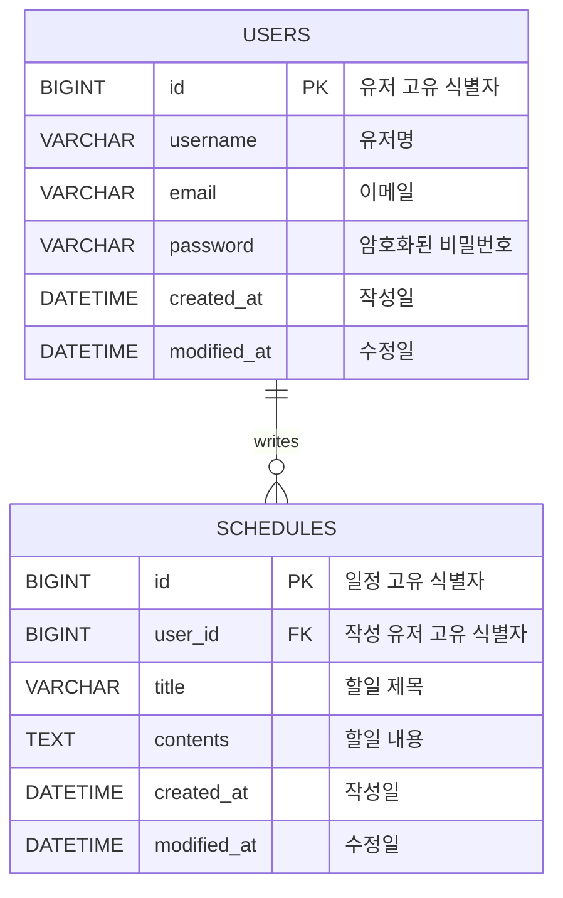

## develop-schedule

Spring Boot와 JPA를 활용한 일정 관리 API 프로젝트입니다.

### 프로젝트 목표

- JPA를 활용한 일정 CRUD 구현
- 유저 CRUD 구현
- 일정과 유저의 단방향 연관관계 구현
- Cookie/Session 기반 로그인/로그아웃 구현
- 비밀번호 BCrypt 암호화 저장
- API 명세서 및 ERD 작성

### 기술 스택

- Java 17
- Spring Boot
- Spring Web
- Spring Data JPA
- MySQL
- Lombok
- Validation
- BCrypt

---

## 공통 인증/인가 정책

- `/users/signup`, `/login`은 로그인 없이 접근할 수 있습니다.
- 그 외 API는 Cookie/Session 기반 로그인 상태에서만 접근할 수 있습니다.
- 일정 생성 시 작성자는 요청 Body의 `userId`가 아니라, 세션에 저장된 로그인 유저 id를 기준으로 결정됩니다.
- 유저 수정/삭제는 본인만 가능합니다. 본인이 아닌 유저를 수정/삭제하려고 하면 `403 Forbidden`을 반환합니다.
- 비밀번호는 BCrypt로 암호화하여 저장하며, API 응답에는 포함하지 않습니다.

---

## 공통 응답 코드

| 상태 코드 | 의미 | 설명 |
|---|---|---|
| 200 OK | 요청 성공 | 조회, 수정, 삭제 요청이 정상 처리된 경우 |
| 201 Created | 생성 성공 | 회원가입, 일정 생성이 정상 처리된 경우 |
| 400 Bad Request | 잘못된 요청 | Validation 실패 등 요청 데이터가 올바르지 않은 경우 |
| 401 Unauthorized | 인증 실패 | 로그인하지 않았거나 이메일/비밀번호가 일치하지 않는 경우 |
| 403 Forbidden | 권한 없음 | 본인이 아닌 유저를 수정/삭제하려는 경우 |
| 404 Not Found | 조회 실패 | 요청한 유저 또는 일정을 찾을 수 없는 경우 |
| 500 Internal Server Error | 서버 오류 | 서버 내부 오류가 발생한 경우 |

---

## API 명세서

| 기능 | Method | URL |
|---|---|---|
| 일정 생성 | POST | `/schedules` |
| 일정 전체 조회 | GET | `/schedules` |
| 일정 단건 조회 | GET | `/schedules/{id}` |
| 일정 수정 | PATCH | `/schedules/{id}` |
| 일정 삭제 | DELETE | `/schedules/{id}` |
| 회원가입 | POST | `/users/signup` |
| 유저 전체 조회 | GET | `/users` |
| 유저 단건 조회 | GET | `/users/{id}` |
| 유저 수정 | PATCH | `/users/{id}` |
| 유저 삭제 | DELETE | `/users/{id}` |
| 로그인 | POST | `/login` |
| 로그아웃 | POST | `/logout` |

---

## 일정 API

### 일정 생성 `POST /schedules`

로그인한 유저의 세션 정보를 기준으로 일정을 생성합니다.  
요청 Body에는 `userId`를 포함하지 않습니다.

Request
```json
{
  "title": "할일 제목",
  "contents": "할일 내용"
}
```

Response
```json
{
  "id": 1,
  "userId": 3,
  "username": "jeongyun",
  "title": "할일 제목",
  "contents": "할일 내용",
  "createdAt": "2026-07-07T10:00:00",
  "modifiedAt": "2026-07-07T10:00:00"
}
```

---

### 일정 전체 조회 `GET /schedules`

로그인한 상태에서 전체 일정을 조회합니다.

Response
```json
[
  {
    "id": 1,
    "userId": 3,
    "username": "jeongyun",
    "title": "할일 제목",
    "contents": "할일 내용",
    "createdAt": "2026-07-07T10:00:00",
    "modifiedAt": "2026-07-07T10:00:00"
  }
]
```

---

### 일정 단건 조회 `GET /schedules/{id}`

로그인한 상태에서 단건 일정을 조회합니다.

Response
```json
{
  "id": 1,
  "userId": 3,
  "username": "jeongyun",
  "title": "할일 제목",
  "contents": "할일 내용",
  "createdAt": "2026-07-07T10:00:00",
  "modifiedAt": "2026-07-07T10:00:00"
}
```

---

### 일정 수정 `PATCH /schedules/{id}`

로그인한 상태에서 일정을 수정합니다.  
수정 요청 Body에는 `userId`를 포함하지 않습니다.

Request
```json
{
  "title": "수정된 제목",
  "contents": "수정된 내용"
}
```

Response
```json
{
  "id": 1,
  "userId": 3,
  "username": "jeongyun",
  "title": "수정된 제목",
  "contents": "수정된 내용",
  "createdAt": "2026-07-07T10:00:00",
  "modifiedAt": "2026-07-07T14:30:00"
}
```

---

### 일정 삭제 `DELETE /schedules/{id}`

로그인한 상태에서 일정을 삭제합니다.

Response
```json
{
  "message": "일정이 삭제되었습니다."
}
```

---

## 유저 API

### 회원가입 `POST /users/signup`

비밀번호는 8글자 이상이어야 하며, BCrypt로 암호화하여 저장합니다.  
응답에는 비밀번호를 포함하지 않습니다.

Request
```json
{
  "username": "jeongyun",
  "email": "jeongyun@example.com",
  "password": "password123"
}
```

Response
```json
{
  "id": 1,
  "username": "jeongyun",
  "email": "jeongyun@example.com",
  "createdAt": "2026-07-07T09:00:00",
  "modifiedAt": "2026-07-07T09:00:00"
}
```

---

### 유저 전체 조회 `GET /users`

로그인한 상태에서 전체 유저를 조회합니다.

Response
```json
[
  {
    "id": 1,
    "username": "jeongyun",
    "email": "jeongyun@example.com",
    "createdAt": "2026-07-07T09:00:00",
    "modifiedAt": "2026-07-07T09:00:00"
  }
]
```

---

### 유저 단건 조회 `GET /users/{id}`

로그인한 상태에서 단건 유저를 조회합니다.

Response
```json
{
  "id": 1,
  "username": "jeongyun",
  "email": "jeongyun@example.com",
  "createdAt": "2026-07-07T09:00:00",
  "modifiedAt": "2026-07-07T09:00:00"
}
```

---

### 유저 수정 `PATCH /users/{id}`

로그인한 유저 본인만 수정할 수 있습니다.  
본인이 아닌 유저를 수정하려고 하면 `403 Forbidden`을 반환합니다.

Request
```json
{
  "username": "수정된 유저명",
  "email": "new@example.com"
}
```

Response
```json
{
  "id": 1,
  "username": "수정된 유저명",
  "email": "new@example.com",
  "createdAt": "2026-07-07T09:00:00",
  "modifiedAt": "2026-07-07T15:00:00"
}
```

---

### 유저 삭제 `DELETE /users/{id}`

로그인한 유저 본인만 삭제할 수 있습니다.  
본인이 아닌 유저를 삭제하려고 하면 `403 Forbidden`을 반환합니다.

Response
```json
{
  "message": "유저가 삭제되었습니다."
}
```

---

## 인증 API

### 로그인 `POST /login`

이메일과 비밀번호를 사용해 로그인합니다.  
로그인 성공 시 서버 세션에 로그인 유저 id를 저장하고, 클라이언트는 `JSESSIONID` 쿠키를 통해 세션을 유지합니다.

Request
```json
{
  "email": "jeongyun@example.com",
  "password": "password123"
}
```

Response
```json
{
  "message": "로그인 되었습니다."
}
```

---

### 로그아웃 `POST /logout`

로그인 상태에서 세션을 만료시킵니다.

Response
```json
{
  "message": "로그아웃 되었습니다."
}
```

---

## ERD



---

### 테이블 관계

| 관계 | 설명 |
|---|---|
| `USERS 1 : N SCHEDULES` | 한 명의 유저는 여러 개의 일정을 작성할 수 있습니다. |
| `SCHEDULES N : 1 USERS` | 하나의 일정은 한 명의 유저에게 속합니다. |

---

### users 테이블

| 컬럼명 | 타입 | 제약조건 | 설명 |
|---|---|---|---|
| id | BIGINT | PK, AUTO_INCREMENT | 유저 고유 식별자 |
| username | VARCHAR | NOT NULL | 유저명 |
| email | VARCHAR | NOT NULL, UNIQUE | 이메일 |
| password | VARCHAR | NOT NULL | BCrypt로 암호화된 비밀번호 |
| created_at | DATETIME | NOT NULL | 작성일 |
| modified_at | DATETIME | NOT NULL | 수정일 |

---

### schedules 테이블

| 컬럼명 | 타입 | 제약조건 | 설명 |
|---|---|---|---|
| id | BIGINT | PK, AUTO_INCREMENT | 일정 고유 식별자 |
| user_id | BIGINT | FK, NOT NULL | 일정을 작성한 유저의 고유 식별자 |
| title | VARCHAR | NOT NULL | 할일 제목 |
| contents | TEXT | NOT NULL | 할일 내용 |
| created_at | DATETIME | NOT NULL | 작성일 |
| modified_at | DATETIME | NOT NULL | 수정일 |

---

### 연관관계 설명

- 한 명의 유저는 여러 개의 일정을 작성할 수 있습니다.
- 하나의 일정은 한 명의 유저에게 속합니다.
- 따라서 `users` 테이블과 `schedules` 테이블은 1:N 관계입니다.
- `schedules.user_id`는 `users.id`를 참조하는 외래키입니다.
- JPA에서는 `Schedule` Entity에서 `User` Entity를 참조하는 단방향 `@ManyToOne` 관계로 구현합니다.
- 일정 API 응답에 포함되는 `username`은 `schedules` 테이블에 직접 저장하지 않고, `user_id`로 연결된 `users` 테이블에서 가져옵니다.